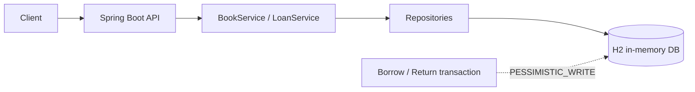
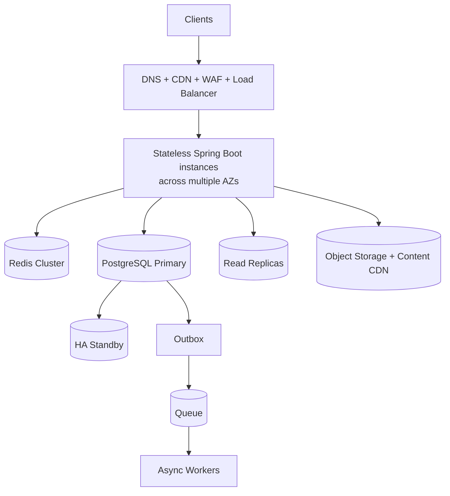

# E-Library Service

This repository contains a Spring Boot implementation of the Mirae Asset backend take-home assignment for an e-library service.

## Scope

The service is user-facing. It supports browsing books, viewing book details, borrowing a digital license, returning a loan, and listing the current user's active loans. The phrase “currently borrowed books” is interpreted as the requesting user's active loans.

The implementation intentionally does not include authentication, book catalog management, waitlists, renewals, fines, or digital file storage and streaming. A minimal admin surface — viewing active loans across all users — is included. `X-User-Id` is a deliberately small identity boundary for the assignment; a real deployment would replace it with an authenticated principal.

A management-side reading of "view currently borrowed books" (an operator looking at active loans across all users) is provided by `GET /api/admin/loans/current`. The identity model is `Principal(userId, role)`, resolved from the `X-User-Id` / `X-User-Role` headers; the admin endpoint requires `X-User-Role: ADMIN` and returns `403` otherwise. The design and trade-offs are documented in [docs/architecture.md](docs/architecture.md).

Each book has a finite number of simultaneous digital licenses. This makes the borrow operation meaningful and provides a concurrency boundary. A future product decision may change this to unlimited licenses or add a waitlist.

## Design choices

- `Book` stores catalog metadata and the current license availability.
- `Loan` stores the immutable borrowing event and its optional return time. Active status is derived from `returnedAt == null`.
- Borrow and return operations lock the corresponding `Book` row with `PESSIMISTIC_WRITE` inside a short database transaction.
- Operations for the same book are serialized by the database row lock. Operations for different books can proceed concurrently.
- Returning a loan is idempotent. Repeating a return returns the already-returned loan and does not release a second license.
- Borrowing is rejected with `409` when the user already has an active loan or no license is available.
- H2 is an in-memory single-instance database for this assignment. A multi-instance production deployment would use a shared transactional database such as PostgreSQL.
- All timestamps use UTC through an injectable `Clock`, which keeps tests deterministic.
- The books endpoint returns an explicit pagination envelope instead of exposing Spring Data `PageImpl`, keeping the HTTP contract independent of framework serialization details.
- Pagination parameters are validated (`page >= 0`, `1 <= size <= 50`) and malformed JSON, type mismatches, missing headers, and domain errors are mapped to the same `ProblemDetail` style.
- A return refreshes the loan entity after acquiring the book lock. This closes the stale first-level-cache window when multiple requests return the same loan concurrently.


## Review notes and trade-offs

The concurrency boundary is the book row rather than a global application lock. This keeps the critical section small: all operations that change a book's license count serialize for that book, while unrelated books can proceed in parallel. The loan is refreshed after the book lock is acquired so concurrent repeated returns remain idempotent even when the transaction initially read an older loan state.

The API deliberately separates client errors from business conflicts: malformed input, invalid pagination, and invalid user headers return `400`; a missing book or loan returns `404`; returning another user's loan returns `403`; and duplicate or unavailable borrowing returns `409`. Unexpected framework serialization details are not exposed as the public contract.

The test suite covers normal API flow, validation and malformed requests, missing resources, ownership checks, duplicate borrowing, unavailable licenses, deterministic pagination, ten-user license contention, same-user duplicate borrowing, and concurrent repeated returns. The concurrency tests verify invariants rather than request completion order because FIFO ordering is not part of the current product requirement.
## Architecture

The repository contains two architecture views:

### Take-home deployment



### Production deployment



The production diagram is intentionally different from the assignment implementation. Browse traffic can use Redis and read replicas, but borrow and return must use the PostgreSQL primary in one transaction. Inventory availability is never decided from a cache or a lagging replica. The complete diagrams, routing rules, failure boundaries, and trade-offs are documented in [docs/architecture.md](docs/architecture.md).
## API

Swagger UI is available at `/swagger-ui.html` when the application is running. OpenAPI JSON is available at `/v3/api-docs`.

```text
GET  /api/books?q=java&category=Programming&page=0&size=20
GET  /api/books/{bookId}

POST /api/loans
     X-User-Id: user-1
     { "bookId": 1 }

GET  /api/loans/current
     X-User-Id: user-1

PUT  /api/loans/{loanId}/return
     X-User-Id: user-1

GET  /api/admin/loans/current
     X-User-Id: admin-1
     X-User-Role: ADMIN
```

Errors use Spring's `ProblemDetail` shape and include a stable application code, such as `BOOK_NOT_FOUND`, `BOOK_UNAVAILABLE`, `ACTIVE_LOAN_ALREADY_EXISTS`, `LOAN_NOT_OWNED_BY_USER`, or `ADMIN_ROLE_REQUIRED`.

## Run and verify

Requirements: Java 21 or newer and Maven 3.9 or newer.

```bash
mvn spring-boot:run
mvn clean verify
```

`mvn clean verify` runs unit and integration tests, including a concurrency test where ten users compete for three licenses. It also generates the JaCoCo report at `target/site/jacoco/index.html`.

For measuring a large catalog, the app can batch-seed 5,000+ books (`--app.seed.bulk.enabled=true --app.seed.bulk.count=5000`) and `scripts/benchmark.sh` measures request latency against the running instance. The resulting baseline and conclusions are in [docs/performance-baseline.md](docs/performance-baseline.md). Both are off by default.

## Concurrency semantics

The service does not promise FIFO ordering for simultaneous HTTP requests. When a return and a borrow race for the last license, whichever transaction obtains the book row lock first is the logical first operation. Both outcomes are valid as long as the database invariants remain true:

```text
0 <= availableLicenses <= totalLicenses
active loans = total licenses - available licenses
one active loan per user and book
an active loan transitions to returned at most once
```

If FIFO fairness or automatic allocation after a return becomes a requirement, the next design would add a per-book waitlist with an explicit sequence number. That is intentionally outside this take-home scope.
