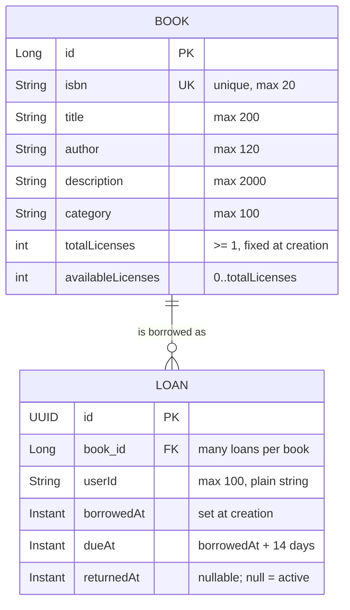
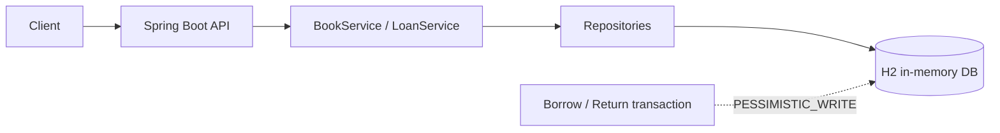

# E-Library Service

This repository contains a Spring Boot implementation of the Mirae Asset backend take-home assignment for an e-library
service.

## Scope

The service is user-facing. It supports browsing books, viewing book details, borrowing a digital license, returning a
loan, and listing the current user's active loans. The phrase “currently borrowed books” is interpreted as the
requesting user's active loans.

The implementation intentionally does not include authentication, book catalog management, waitlists, renewals, fines,
or digital file storage and streaming.

`X-User-Id` is a deliberately small identity boundary for the assignment; a real deployment would replace it with an
authenticated principal.

### Assignment scope vs. extra material

The brief asks for a 4–6 hour take-home with a deliberately limited range. To keep that boundary explicit, this README
is split into two kinds of content:

| Kind | Content | Where |
| --- | --- | --- |
| **Assignment scope** — required by the brief | books browsing/detail, borrow, return, current loans, domain model, code organization, API contract, error handling | sections above and through “Concurrency semantics” |
| **Extra material** — beyond the brief, optional reading | production architecture, performance baseline / benchmark, written spec set, management-side admin endpoint | [Beyond the assignment scope](#beyond-the-assignment-scope) |

Each book has a finite number of simultaneous digital licenses. This makes the borrow operation meaningful and provides
a concurrency boundary. A future product decision may change this to unlimited licenses or add a waitlist.

## Quick start

Requirements: Java 21 or newer and Maven 3.9 or newer.

```bash
mvn spring-boot:run
mvn clean verify
```

`mvn clean verify` runs unit and integration tests, including a concurrency test where ten users compete for three
licenses. It also generates the JaCoCo report at `target/site/jacoco/index.html`.

Once running: Swagger UI at `/swagger-ui.html`, OpenAPI JSON at `/v3/api-docs`.

Try the main flow with `curl`:

```bash
curl 'http://localhost:8080/api/books?page=0&size=5'
curl 'http://localhost:8080/api/books/1'
curl -X POST http://localhost:8080/api/loans -H 'X-User-Id: user-1' -H 'Content-Type: application/json' -d '{"bookId":1}'
curl 'http://localhost:8080/api/loans/current' -H 'X-User-Id: user-1'
curl -X PUT http://localhost:8080/api/loans/{loanId}/return -H 'X-User-Id: user-1'
```

## API

Swagger UI is available at `/swagger-ui.html` when the application is running. OpenAPI JSON is available at
`/v3/api-docs`.

```text
GET  /api/books?q=java&category=Programming&page=0&size=20
GET  /api/books/{bookId}

POST /api/loans
     X-User-Id: user-1
     { "bookId": 1 }

GET  /api/loans/current
     X-User-Id: user-1

PUT  /api/loans/{loanId}/return
     X-User-Id: user-1

GET  /api/admin/loans/current
     X-User-Id: admin-1
     X-User-Role: ADMIN
```

### Requirement to endpoint mapping

| # | Requirement (from the brief) | Endpoint | Required |
| --- | --- | --- | --- |
| 1 | 瀏覽書籍 / Browse books | `GET /api/books` | Yes |
| 2 | 查詢書籍詳細資料 / Book details | `GET /api/books/{bookId}` | Yes |
| 3 | 借閱書籍 / Borrow a book | `POST /api/loans` | Yes |
| 4 | 歸還書籍 / Return a book | `PUT /api/loans/{loanId}/return` | Yes |
| 5 | 查看目前已借閱的書籍 / Current loans — user-side reading | `GET /api/loans/current` | Yes |
| 5' | 查看目前已借閱的書籍 / Current loans — management-side reading | `GET /api/admin/loans/current` | No (extra) |

### Error codes

Errors use Spring's `ProblemDetail` shape; the stable application code is returned in both the `title` and the `code`
property. Every error response is rendered by
[ApiExceptionHandler.java](src/main/java/com/miraeasset/elibrary/common/ApiExceptionHandler.java); the code itself is
chosen by the layer that detects the problem (validation, service, or the admin interceptor).

| Code | HTTP | Raised when |
| --- | --- | --- |
| `INVALID_USER` | 400 | `X-User-Id` is blank or longer than 100 characters |
| `INVALID_PAGE` | 400 | `page < 0` |
| `INVALID_PAGE_SIZE` | 400 | `size` is outside `1..50` |
| `INVALID_REQUEST` | 400 | malformed/missing JSON body, missing required header, parameter type mismatch, bean validation failure |
| `LOAN_NOT_OWNED_BY_USER` | 403 | returning a loan that belongs to another user |
| `ADMIN_ROLE_REQUIRED` | 403 | calling `/api/admin/**` without the `ADMIN` role claim |
| `BOOK_NOT_FOUND` | 404 | `bookId` does not exist |
| `LOAN_NOT_FOUND` | 404 | `loanId` does not exist |
| `ACTIVE_LOAN_ALREADY_EXISTS` | 409 | the user already has an active loan **for that same book** |
| `BOOK_UNAVAILABLE` | 409 | no digital license is available for the book |

## Domain model

Two aggregates. `Book` owns catalog metadata and the license counter; `Loan` is an append-only borrowing event whose
active state is derived, not stored.



Source of truth: [Book.java](src/main/java/com/miraeasset/elibrary/book/Book.java) and
[Loan.java](src/main/java/com/miraeasset/elibrary/loan/Loan.java).

### Aggregate behaviour

| Member | Guarantee |
| --- | --- |
| `Book.create` | rejects `totalLicenses < 1`; `availableLicenses` starts equal to `totalLicenses` |
| `Book.borrowLicense` | rejects `availableLicenses <= 0`; otherwise decrements it |
| `Book.returnLicense` | rejects `availableLicenses >= totalLicenses`; otherwise increments it |
| `Loan.create` | derives `dueAt = borrowedAt + 14 days` |
| `Loan.markReturned` | no-op when the loan is already returned, so the return transition happens at most once |
| `Loan.isActive` | derived: `returnedAt == null` |

### Invariants

Stated formally, with the place that enforces each one:

| Id | Invariant | Enforced by |
| --- | --- | --- |
| I1 | `book.totalLicenses >= 1` | `Book.create` |
| I2 | `0 <= book.availableLicenses <= book.totalLicenses` | `Book.borrowLicense` / `Book.returnLicense` plus the `BOOK_UNAVAILABLE` check in `LoanService.borrow` |
| I3 | for every book, `count(active loans) = totalLicenses - availableLicenses` | both counter changes and the `Loan` insert/update commit inside one `@Transactional` method that holds the book row lock |
| I4 | at most one active loan per `(userId, bookId)` | `LoanRepository.existsByBookIdAndUserIdAndReturnedAtIsNull` inside the locked borrow transaction |
| I5 | a loan is active **iff** `returnedAt == null` | `Loan.isActive`; `returnedAt` is never written twice (`Loan.markReturned`) |
| I6 | once a loan is returned, `returnedAt` never changes (return is idempotent) | `Loan.markReturned` early-return, plus the `entityManager.refresh` re-check in `LoanService.returnLoan` |
| I7 | `loan.dueAt = loan.borrowedAt + 14 days` | `Loan.create` |

I3 and I4 are the two invariants that span both aggregates; they are the reason borrow holds the book row lock for the
whole transaction rather than decrementing the counter in isolation (see [Trade-offs](docs/en/architecture.md)).

## Code organization

Packages are organized by feature, not by technical layer, so a feature's controller, service, repository, entity and
DTOs live together. Cross-cutting concerns sit in `common`, and the identity seam sits in `identity`.

```text
com.miraeasset.elibrary
├── ELibraryApplication.java          Spring Boot entry point
├── book/                             feature: catalog + license counter (the concurrency boundary)
│   ├── Book.java                     aggregate root
│   ├── BookController.java           GET /api/books, GET /api/books/{bookId}
│   ├── BookService.java              read-only queries (no writes)
│   ├── BookRepository.java
│   └── dto/                          BookSummaryResponse, BookDetailResponse
├── loan/                             feature: borrowing
│   ├── Loan.java                     aggregate: append-only borrowing event
│   ├── LoanController.java           user-facing borrow / return / current loans
│   ├── AdminController.java          management-side current loans (/api/admin/loans)
│   ├── LoanService.java              transactional commands + admin read
│   ├── LoanRepository.java
│   └── dto/                          BorrowBookRequest, LoanResponse
├── identity/                         Principal(userId, role), Role
├── config/                           WebConfig, PrincipalArgumentResolver, AdminRoleInterceptor,
│                                     OpenApiConfig, DataSeeder, FaviconController
└── common/                           ApiExceptionHandler, domain exception types,
                                      dto/PageResponse, TimeConfig (injectable Clock)
```

Rules this layout follows:

- **Direction is `controller -> service -> repository -> database`.** Controllers never touch repositories directly,
  and they never return entities; each feature exposes DTOs from its own `dto` package, so the HTTP contract is
  independent of the persistence model.
- **The only feature-to-feature dependency is `loan -> book`.** A loan needs the book's license counter, so `LoanService`
  uses `BookRepository` and `Loan` holds a `Book` reference. `book` never references `loan`, so the graph stays acyclic.
- **`common` and `identity` depend on no feature.** `common` holds error mapping, the pagination envelope and the
  injectable `Clock`; `identity` holds the `Principal(userId, role)` seam used by the argument resolver.
- **The admin surface is separate at the HTTP boundary but shares the loan service.** `AdminController` is mounted under
  `/api/admin/**`, which is default-deny via `AdminRoleInterceptor`; its read path calls a `@Transactional(readOnly = true)`
  method and never touches the license counter, so it shares no lock or caching behaviour with the borrow/return path.

## Design choices

- `Book` stores catalog metadata and the current license availability.
- `Loan` stores the immutable borrowing event and its optional return time. Active status is derived from
  `returnedAt == null`.
- Borrow and return operations lock the corresponding `Book` row with `PESSIMISTIC_WRITE` inside a short database
  transaction.
- Operations for the same book are serialized by the database row lock. Operations for different books can proceed
  concurrently.
- Returning a loan is idempotent. Repeating a return returns the already-returned loan and does not release a second
  license.
- Borrowing is rejected with `409` when the user already has an active loan **for that book** (I4) or when no license is
  available (I2).
- H2 is an in-memory single-instance database for this assignment. A multi-instance production deployment would use a
  shared transactional database such as PostgreSQL.
- All timestamps use UTC through an injectable `Clock`, which keeps tests deterministic.
- The books endpoint returns an explicit pagination envelope instead of exposing Spring Data `PageImpl`, keeping the
  HTTP contract independent of framework serialization details.
- Pagination parameters are validated (`page >= 0`, `1 <= size <= 50`) and malformed JSON, type mismatches, missing
  headers, and domain errors are mapped to the same `ProblemDetail` style.
- A return refreshes the loan entity after acquiring the book lock. This closes the stale first-level-cache window when
  multiple requests return the same loan concurrently.

## Review notes and trade-offs

The concurrency boundary is the book row rather than a global application lock. This keeps the critical section small:
all operations that change a book's license count serialize for that book, while unrelated books can proceed in
parallel. The loan is refreshed after the book lock is acquired so concurrent repeated returns remain idempotent even
when the transaction initially read an older loan state.

The API deliberately separates client errors from business conflicts: malformed input, invalid pagination, and invalid
user headers return `400`; a missing book or loan returns `404`; returning another user's loan returns `403`; and
duplicate-borrowing-within-the-same-book or unavailable licenses return `409`. Unexpected framework serialization
details are not exposed as the public contract.

The test suite covers normal API flow, validation and malformed requests, missing resources, ownership checks, duplicate
borrowing, unavailable licenses, deterministic pagination, ten-user license contention, same-user duplicate borrowing,
and concurrent repeated returns. The concurrency tests verify invariants rather than request completion order because
FIFO ordering is not part of the current product requirement.

## Architecture

The assignment deployment is a single Spring Boot process over H2, with the book row as the concurrency boundary.



This diagram is the canonical assignment view; [docs/en/architecture.md](docs/en/architecture.md) deliberately does not
repeat it and instead documents the lock behaviour, the production deployment, and the trade-offs.

A production-oriented view (multi-AZ stateless instances, Redis, PostgreSQL primary with replicas, object storage) is
described in [docs/en/architecture.md](docs/en/architecture.md). It is **extra material beyond the brief** and is not
part of the assignment implementation; the short version is that browse traffic can use caches and read replicas while
borrow and return must use one authoritative write transaction, because inventory availability must never be decided
from a cache or a lagging replica.

## Concurrency semantics

The service does not promise FIFO ordering for simultaneous HTTP requests. When a return and a borrow race for the last
license, whichever transaction obtains the book row lock first is the logical first operation. Both outcomes are valid
as long as the concurrency-relevant invariants from [Domain model](#invariants) (I1–I6; I7 is structural and not
concurrency-dependent) remain true:

```text
I1  1 <= book.totalLicenses
I2  0 <= book.availableLicenses <= book.totalLicenses
I3  count(active loans of a book) = totalLicenses - availableLicenses
I4  at most one active loan per (userId, bookId)
I5  a loan is active iff returnedAt == null
I6  a returned loan never becomes active again
```

If FIFO fairness or automatic allocation after a return becomes a requirement, the next design would add a per-book
waitlist with an explicit sequence number. That is intentionally outside this take-home scope.

The lock mechanism itself — and why the implementation keeps read-modify-write instead of a single conditional `UPDATE`
— is argued once in [docs/en/architecture.md](docs/en/architecture.md), not repeated here.

## Beyond the assignment scope

These artifacts exist to show the reasoning behind the design, but they are not required by the brief and can be
skipped without affecting the implementation:

| Artifact | Purpose |
| --- | --- |
| [docs/en/architecture.md](docs/en/architecture.md) | production deployment view: routing rules, failure boundaries, trade-offs |
| [docs/en/performance-baseline.md](docs/en/performance-baseline.md) | measured latency baseline against a 5,000+ book catalog |
| [docs/spec/README.md](docs/spec/README.md) | written spec set: requirement analysis, system spec, API contract, traceability matrix |
| `GET /api/admin/loans/current` | management-side reading of "currently borrowed books" |

The benchmark and bulk seeding are off by default; enabling them is optional and only needed to reproduce the baseline:

```bash
mvn spring-boot:run -Dspring-boot.run.arguments="--app.seed.bulk.enabled=true --app.seed.bulk.count=5000"
scripts/benchmark.sh
```

## Engineering workflow

The implementation is organized around a specification-driven workflow:

1. **Requirement analysis** — clarify scope, assumptions, actors, and non-goals.
2. **SpecDD** — define domain invariants, API contracts, persistence boundaries, concurrency rules, and acceptance
   criteria.
3. **Agentic Coding** — use an AI coding agent to implement scoped changes and tests under human-owned design decisions
   and review.
4. **Verification** — run unit, API, concurrency, and coverage checks against the traceability matrix.

The consolidated design entry point is [docs/spec/README.md](docs/spec/README.md). The runtime API specification is
available through Swagger UI at `/swagger-ui.html` and OpenAPI JSON at `/v3/api-docs`.