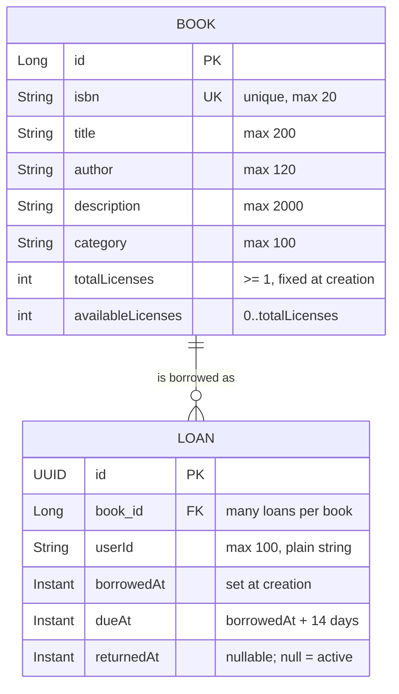
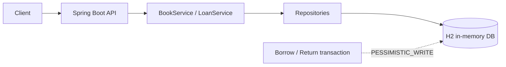

# 电子图书馆服务（E-Library Service）

本仓库是 Mirae Asset 后端 take-home 任务——电子图书馆服务 的 Spring Boot 实现。

> 中文版说明文档。英文原版见 [README.md](README.md)
> ；架构与设计取舍见 [docs/zh-CN/architecture.md](docs/zh-CN/architecture.md)
> ；针对需求的逐项回答与设计说明见 [docs/zh-CN/design-answers.md](docs/zh-CN/design-answers.md)。

## 范围（Scope）

本服务面向用户侧：支持浏览书籍、查看书籍详情、借阅数字授权、归还借阅，以及查看当前用户已借阅的书籍。“目前已借阅的书籍”在这里解释为
**请求方用户自己的活跃借阅**。

实现 **有意不包含**：认证、图书目录管理、预约/等待列表（waitlist）、续借、罚款、以及数字文件存储与流媒体。

`X-User-Id` 是本作业刻意采用的最小身份边界；生产环境会替换为经过认证的主体（authenticated principal）。

### 作业范围与额外展示（Assignment scope vs. extra material）

题目要求控制在 4–6 小时，并明确要求“请控制实作范围在合理程度”。为了让这条边界清晰可见，本文档把内容分成两类：

| 类别 | 内容 | 位置 |
| --- | --- | --- |
| **作业范围**——题目要求 | 浏览/详情、借阅、归还、当前借阅、领域模型、代码组织、API 契约、错误处理 | 本文档至“并发语义”为止的各节 |
| **额外展示**——超出题目要求，可选阅读 | 生产架构、性能基线/benchmark、规格文档集、管理端接口 | [超出作业范围的部分](#超出作业范围的部分) |

每本书有 **有限的并发数字授权**。这让借阅操作具有业务含义，也构成了并发的边界。未来产品决策可改为无限授权或加入等待列表。

## 快速开始（Quick start）

要求：Java 21 或更新，Maven 3.9 或更新。

```bash
mvn spring-boot:run
mvn clean verify
```

`mvn clean verify` 依次执行单元测试与集成测试，包括一个“十用户竞争三授权”的并发测试，并生成 JaCoCo 报告
`target/site/jacoco/index.html`。

启动后：Swagger UI 在 `/swagger-ui.html`，OpenAPI JSON 在 `/v3/api-docs`。

用 `curl` 走一遍主流程：

```bash
curl 'http://localhost:8080/api/books?page=0&size=5'
curl 'http://localhost:8080/api/books/1'
curl -X POST http://localhost:8080/api/loans -H 'X-User-Id: user-1' -H 'Content-Type: application/json' -d '{"bookId":1}'
curl 'http://localhost:8080/api/loans/current' -H 'X-User-Id: user-1'
curl -X PUT http://localhost:8080/api/loans/{loanId}/return -H 'X-User-Id: user-1'
```

## API

应用运行时可访问 Swagger UI：`/swagger-ui.html`；OpenAPI JSON：`/v3/api-docs`。

```text
GET  /api/books?q=java&category=Programming&page=0&size=20
GET  /api/books/{bookId}

POST /api/loans
     X-User-Id: user-1
     { "bookId": 1 }

GET  /api/loans/current
     X-User-Id: user-1

PUT  /api/loans/{loanId}/return
     X-User-Id: user-1

GET  /api/admin/loans/current
     X-User-Id: admin-1
     X-User-Role: ADMIN
```

### 需求与接口对照（Requirement to endpoint mapping）

| # | 需求（原始题目） | 接口 | 是否题目要求 |
| --- | --- | --- | --- |
| 1 | 瀏覽書籍 / 浏览书籍 | `GET /api/books` | 是 |
| 2 | 查詢書籍詳細資料 / 查询书籍详情 | `GET /api/books/{bookId}` | 是 |
| 3 | 借閱書籍 / 借阅书籍 | `POST /api/loans` | 是 |
| 4 | 歸還書籍 / 归还书籍 | `PUT /api/loans/{loanId}/return` | 是 |
| 5 | 查看目前已借閱的書籍 / 当前借阅——用户侧解读 | `GET /api/loans/current` | 是 |
| 5' | 查看目前已借閱的書籍 / 当前借阅——管理侧解读 | `GET /api/admin/loans/current` | 否（额外展示） |

### 错误码（Error codes）

错误使用 Spring 的 `ProblemDetail` 结构；稳定的应用错误码同时出现在 `title` 与 `code` 属性中。所有错误响应统一由
[ApiExceptionHandler.java](src/main/java/com/miraeasset/elibrary/common/ApiExceptionHandler.java) 渲染；错误码本身由发现问题的层决定（校验、service，或管理端拦截器）。

| 错误码 | HTTP | 触发条件 |
| --- | --- | --- |
| `INVALID_USER` | 400 | `X-User-Id` 为空白或超过 100 字符 |
| `INVALID_PAGE` | 400 | `page < 0` |
| `INVALID_PAGE_SIZE` | 400 | `size` 不在 `1..50` 范围内 |
| `INVALID_REQUEST` | 400 | 请求体缺失/畸形、缺少必需请求头、参数类型不匹配、Bean Validation 失败 |
| `LOAN_NOT_OWNED_BY_USER` | 403 | 归还他人的借阅 |
| `ADMIN_ROLE_REQUIRED` | 403 | 无 `ADMIN` 角色声明访问 `/api/admin/**` |
| `BOOK_NOT_FOUND` | 404 | `bookId` 不存在 |
| `LOAN_NOT_FOUND` | 404 | `loanId` 不存在 |
| `ACTIVE_LOAN_ALREADY_EXISTS` | 409 | 用户对**同一本书**已有活跃借阅 |
| `BOOK_UNAVAILABLE` | 409 | 该书没有可用授权 |

## 领域模型（Domain model）

两个聚合。`Book` 持有书目元数据与授权计数；`Loan` 是不可变的借阅事件，其活跃状态由 `returnedAt == null` 推导，而非单独存储。



真值来源：[Book.java](src/main/java/com/miraeasset/elibrary/book/Book.java) 与
[Loan.java](src/main/java/com/miraeasset/elibrary/loan/Loan.java)。

### 聚合行为（Aggregate behaviour）

| 成员 | 保证 |
| --- | --- |
| `Book.create` | 拒绝 `totalLicenses < 1`；`availableLicenses` 初始等于 `totalLicenses` |
| `Book.borrowLicense` | 拒绝 `availableLicenses <= 0`；否则减一 |
| `Book.returnLicense` | 拒绝 `availableLicenses >= totalLicenses`；否则加一 |
| `Loan.create` | 推导 `dueAt = borrowedAt + 14 天` |
| `Loan.markReturned` | 借阅已归还时为空操作，保证“归还”状态转换至多发生一次 |
| `Loan.isActive` | 推导得出：`returnedAt == null` |

### 不变式（Invariants）

以形式化方式列出，并标注每条的强制位置：

| 编号 | 不变式 | 强制位置 |
| --- | --- | --- |
| I1 | `book.totalLicenses >= 1` | `Book.create` |
| I2 | `0 <= book.availableLicenses <= book.totalLicenses` | `Book.borrowLicense` / `Book.returnLicense`，以及 `LoanService.borrow` 中的 `BOOK_UNAVAILABLE` 检查 |
| I3 | 对每本书：`count(活跃借阅) = totalLicenses - availableLicenses` | 计数变更与 `Loan` 插入/更新在同一个持有书籍行锁的 `@Transactional` 方法内提交 |
| I4 | 每个 `(userId, bookId)` 至多一条活跃借阅 | 加锁的借阅事务内调用 `LoanRepository.existsByBookIdAndUserIdAndReturnedAtIsNull` |
| I5 | 借阅活跃 **当且仅当** `returnedAt == null` | `Loan.isActive`；`returnedAt` 不会被写第二次（`Loan.markReturned`） |
| I6 | 已归还借阅的 `returnedAt` 不再改变（归还幂等） | `Loan.markReturned` 的提前返回，加上 `LoanService.returnLoan` 中的 `entityManager.refresh` 复查 |
| I7 | `loan.dueAt = loan.borrowedAt + 14 天` | `Loan.create` |

I3 与 I4 是横跨两个聚合的两条不变式；这也是借阅要在整个事务期间持有书籍行锁、而不是孤立地扣减计数器的原因（见
[Trade-offs](docs/zh-CN/architecture.md)）。

## 代码组织（Code organization）

包按 **功能（feature）** 划分，而非按技术分层，因此某个功能的 controller、service、repository、实体与 DTO 放在一起。横切关注点放在
`common`，身份缝（identity seam）放在 `identity`。

```text
com.miraeasset.elibrary
├── ELibraryApplication.java          Spring Boot 入口
├── book/                             功能：书目 + 授权计数（并发边界所在）
│   ├── Book.java                     聚合根
│   ├── BookController.java           GET /api/books、GET /api/books/{bookId}
│   ├── BookService.java              只读查询（不含写操作）
│   ├── BookRepository.java
│   └── dto/                          BookSummaryResponse、BookDetailResponse
├── loan/                             功能：借阅
│   ├── Loan.java                     聚合：不可变的借阅事件
│   ├── LoanController.java           用户侧借阅 / 归还 / 当前借阅
│   ├── AdminController.java          管理侧当前借阅（/api/admin/loans）
│   ├── LoanService.java              事务性命令 + 管理侧读取
│   ├── LoanRepository.java
│   └── dto/                          BorrowBookRequest、LoanResponse
├── identity/                         Principal(userId, role)、Role
├── config/                           WebConfig、PrincipalArgumentResolver、AdminRoleInterceptor、
│                                     OpenApiConfig、DataSeeder、FaviconController
└── common/                           ApiExceptionHandler、领域异常类型、
                                      dto/PageResponse、TimeConfig（可注入 Clock）
```

这套结构遵循的规则：

- **依赖方向为 `controller -> service -> repository -> database`**。控制器不直接访问 repository，也不返回实体；每个功能从自己的
  `dto` 包对外暴露 DTO，因此 HTTP 契约独立于持久化模型。
- **唯一的跨功能依赖是 `loan -> book`**。借阅需要书籍的授权计数，因此 `LoanService` 使用 `BookRepository`，`Loan` 持有 `Book`
  引用。`book` 从不反向引用 `loan`，因此依赖图保持无环。
- **`common` 与 `identity` 不依赖任何功能包**。`common` 承载错误映射、分页封装与可注入的 `Clock`；`identity` 承载参数解析器使用的
  `Principal(userId, role)` 缝。
- **管理面在 HTTP 边界上独立，但复用借阅 service**。`AdminController` 挂载在 `/api/admin/**` 下，由 `AdminRoleInterceptor`
  默认拒绝；其读路径调用 `@Transactional(readOnly = true)` 方法，且从不触碰授权计数，因此与借阅/归还路径不共享锁或缓存行为。

## 设计要点（Design choices）

- `Book` 保存书目元数据与当前可用授权数。
- `Loan` 保存不可变的借阅事件及其可选的归还时间。活跃状态由 `returnedAt == null` 推导。
- 借阅与归还在一个短数据库事务内，对对应 `Book` 行加 `PESSIMISTIC_WRITE` 锁。
- 同一本书的操作被数据库行锁串行化；不同书籍可并发处理。
- 归还具有幂等性：重复归还返回已归还的借阅记录，不会二次释放授权。
- 当用户对**同一本书**已有活跃借阅（I4）、或没有可用授权（I2）时，借阅返回 `409`。
- 本作业使用 H2 内存单实例数据库；多实例生产环境会使用如 PostgreSQL 的共享事务型数据库。
- 所有时间戳通过可注入的 `Clock` 使用 UTC，保证测试结果确定。
- books 接口返回显式的分页封装（envelope），而非暴露 Spring Data 的 `PageImpl`，使 HTTP 契约不依赖框架序列化细节。
- 分页参数做了校验（`page >= 0`，`1 <= size <= 50`）；畸形 JSON、类型不匹配、缺失请求头、领域错误统一映射为同一种
  `ProblemDetail` 风格。
- 归还时在取得书籍锁之后刷新 loan 实体，关闭多个请求并发归还同一借阅时的一级缓存过期窗口。

## 评审要点与取舍（Review notes and trade-offs）

并发边界是 **书籍行**而非全局应用锁。这样临界区很小：所有改变某书授权数的操作针对该书串行化，而无关书籍可并行处理。取得书锁后刷新
loan，因此即使事务最初读到较旧的 loan 状态，并发的重复归还也保持幂等。

API 刻意区分客户端错误与业务冲突：畸形输入、非法分页、非法用户头返回 `400`；书籍/借阅不存在返回 `404`；归还他人借阅返回 `403`
；同一本书的重复借阅或授权不可用返回 `409`。不外泄意外发生的框架序列化细节作为公开契约。

测试套件覆盖：正常 API 流程、校验与畸形请求、资源缺失、所有权检查、重复借阅、不可用授权、确定性分页、十个用户竞争授权、同用户重复借阅、并发重复归还。并发测试验证的是
**不变式**而非请求完成顺序，因为 FIFO 排序并非当前产品需求。

## 架构（Architecture）

作业部署是一个运行在 H2 之上的 Spring Boot 进程，以书籍行作为并发边界。



这张图是作业视图的规范来源；[docs/zh-CN/architecture.md](docs/zh-CN/architecture.md) 刻意不再重复它，而是记录锁行为、生产部署与取舍。

面向生产的架构视图（多可用区无状态实例、Redis、带只读副本的 PostgreSQL 主库、对象存储）见
[docs/zh-CN/architecture.md](docs/zh-CN/architecture.md)。它属于 **超出题目要求的额外展示**，不是作业实现的一部分；简要结论是：浏览类流量可以使用缓存与只读副本，但借阅与归还必须在同一个权威写事务中完成，因为库存可用性绝不可由缓存或滞后的副本决定。

## 并发语义（Concurrency semantics）

本服务不承诺对同时到达的 HTTP 请求做 FIFO 排序。当一次归还与一次借阅竞争最后一个授权时，先拿到书籍行锁的事务视为逻辑上的先发生操作。只要
[领域模型](#不变式invariants) 中与并发相关的 I1–I6 成立（I7 是结构性约束，与并发无关），两种结果都有效：

```text
I1  1 <= book.totalLicenses
I2  0 <= book.availableLicenses <= book.totalLicenses
I3  count(active loans of a book) = totalLicenses - availableLicenses
I4  at most one active loan per (userId, bookId)
I5  a loan is active iff returnedAt == null
I6  a returned loan never becomes active again
```

如果需要 FIFO 公平或归还后自动分配，下一步设计会在每本书上加一个带显式序号（sequence
number）的等待列表（waitlist）。该能力刻意不在本次作业范围内。

锁机制本身——以及实现为何保留“读-改-写”而非改用单条条件 `UPDATE`——在
[docs/zh-CN/architecture.md](docs/zh-CN/architecture.md) 中论证一次，此处不再重复。

## 超出作业范围的部分

以下内容用于展示设计推演过程，但并非题目要求，跳过也不影响对实现的理解：

| 内容 | 用途 |
| --- | --- |
| [docs/zh-CN/architecture.md](docs/zh-CN/architecture.md) | 生产部署视图：路由规则、故障边界、取舍 |
| [docs/zh-CN/performance-baseline.md](docs/zh-CN/performance-baseline.md) | 针对 5000+ 本书目录测得的延迟基线 |
| [docs/spec/README.md](docs/spec/README.md) | 规格文档集：需求分析、系统规格、API 契约、追踪矩阵 |
| `GET /api/admin/loans/current` | “查看目前已借阅的书籍”的管理侧解读 |

benchmark 与批量灌数默认关闭；仅在需要复现基线时才需要开启：

```bash
mvn spring-boot:run -Dspring-boot.run.arguments="--app.seed.bulk.enabled=true --app.seed.bulk.count=5000"
scripts/benchmark.sh
```

## 工程流程（Engineering workflow）

本项目采用规格驱动的开发流程：

1. **需求分析**：明确范围、角色、假设和非目标。
2. **SpecDD**：定义领域不变式、API 契约、持久化边界、并发规则和验收标准。
3. **Agentic Coding**：在设计决策和代码评审由人负责的前提下，使用 AI coding agent 按规格实现代码与测试。
4. **验证**：通过单元测试、API 测试、并发测试和覆盖率检查验证实现。

完整入口见 [docs/spec/README.md](docs/spec/README.md)
，需求—设计—代码—测试追踪见 [docs/spec/04-traceability-matrix.md](docs/spec/04-traceability-matrix.md)。