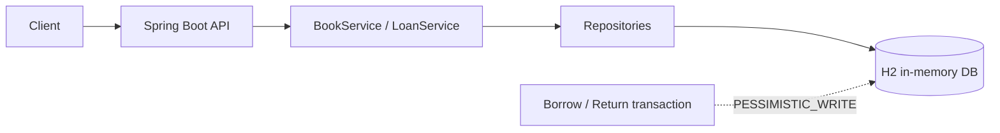
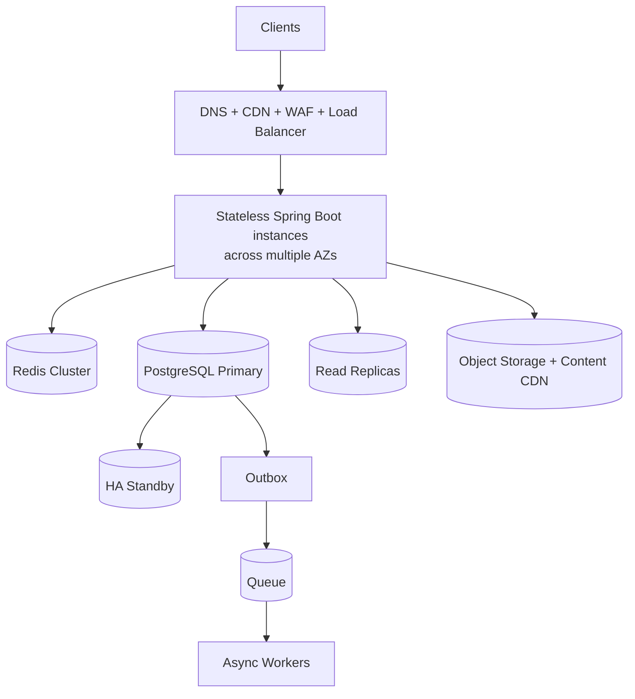

# 电子图书馆服务（E-Library Service）

本仓库是 Mirae Asset 后端 take-home 任务——电子图书馆服务 的 Spring Boot 实现。

> 中文版说明文档。英文原版见 [README.md](README.md)；架构与设计取舍见 [docs/zh-CN/architecture.md](docs/zh-CN/architecture.md)；针对需求的逐项回答与设计说明见 [docs/zh-CN/design-answers.md](docs/zh-CN/design-answers.md)。

## 范围（Scope）

本服务面向用户侧：支持浏览书籍、查看书籍详情、借阅数字授权、归还借阅，以及查看当前用户已借阅的书籍。“目前已借阅的书籍”在这里解释为**请求方用户自己的活跃借阅**。

实现**有意不包含**：认证、图书目录管理、预约/等待列表（waitlist）、续借、罚款、以及数字文件存储与流媒体。一个**最小的管理面**——查看所有用户活跃借阅——已包含。`X-User-Id` 是本作业刻意采用的最小身份边界；生产环境会替换为经过认证的主体（authenticated principal）。

“查看目前已借阅的书籍”的管理侧语义（运营者查看所有用户的活跃借阅）由 `GET /api/admin/loans/current` 提供。身份模型为 `Principal(userId, role)`，从 `X-User-Id` / `X-User-Role` 请求头解析；该管理接口要求 `X-User-Role: ADMIN`，否则返回 `403`。设计与取舍详见 [docs/zh-CN/architecture.md](docs/zh-CN/architecture.md)。

每本书有**有限的并发数字授权**。这让借阅操作具有业务含义，也构成了并发的边界。未来产品决策可改为无限授权或加入等待列表。

## 设计要点（Design choices）

- `Book` 保存书目元数据与当前可用授权数。
- `Loan` 保存不可变的借阅事件及其可选的归还时间。活跃状态由 `returnedAt == null` 推导。
- 借阅与归还在一个短数据库事务内，对对应 `Book` 行加 `PESSIMISTIC_WRITE` 锁。
- 同一本书的操作被数据库行锁串行化；不同书籍可并发处理。
- 归还具有幂等性：重复归还返回已归还的借阅记录，不会二次释放授权。
- 当用户已有该书的活跃借阅、或没有可用授权时，借阅返回 `409`。
- 本作业使用 H2 内存单实例数据库；多实例生产环境会使用如 PostgreSQL 的共享事务型数据库。
- 所有时间戳通过可注入的 `Clock` 使用 UTC，保证测试结果确定。
- books 接口返回显式的分页封装（envelope），而非暴露 Spring Data 的 `PageImpl`，使 HTTP 契约不依赖框架序列化细节。
- 分页参数做了校验（`page >= 0`，`1 <= size <= 50`）；畸形 JSON、类型不匹配、缺失请求头、领域错误统一映射为同一种 `ProblemDetail` 风格。
- 归还时在取得书籍锁之后刷新 loan 实体，关闭多个请求并发归还同一借阅时的一级缓存过期窗口。

## 评审要点与取舍（Review notes and trade-offs）

并发边界是**书籍行**而非全局应用锁。这样临界区很小：所有改变某书授权数的操作针对该书串行化，而无关书籍可并行处理。取得书锁后刷新 loan，因此即使事务最初读到较旧的 loan 状态，并发的重复归还也保持幂等。

API 刻意区分客户端错误与业务冲突：畸形输入、非法分页、非法用户头返回 `400`；书籍/借阅不存在返回 `404`；归还他人借阅返回 `403`；重复或不可用的借阅返回 `409`。不外泄意外发生的框架序列化细节作为公开契约。

测试套件覆盖：正常 API 流程、校验与畸形请求、资源缺失、所有权检查、重复借阅、不可用授权、确定性分页、十个用户竞争授权、同用户重复借阅、并发重复归还。并发测试验证的是**不变式**而非请求完成顺序，因为 FIFO 排序并非当前产品需求。

## 架构（Architecture）

仓库包含两种架构视图：

### 作业部署（Take-home deployment）



### 生产部署（Production deployment）



生产图刻意与作业实现不同：浏览类流量可使用 Redis 与只读副本，但借阅与归还必须在 PostgreSQL 主库的同一事务中完成；**库存可用性绝不由缓存或滞后的副本决定**。完整图、路由规则、故障边界与取舍见 [docs/zh-CN/architecture.md](docs/zh-CN/architecture.md)。

## API

应用运行时可访问 Swagger UI：`/swagger-ui.html`；OpenAPI JSON：`/v3/api-docs`。

```text
GET  /api/books?q=java&category=Programming&page=0&size=20
GET  /api/books/{bookId}

POST /api/loans
     X-User-Id: user-1
     { "bookId": 1 }

GET  /api/loans/current
     X-User-Id: user-1

PUT  /api/loans/{loanId}/return
     X-User-Id: user-1

GET  /api/admin/loans/current
     X-User-Id: admin-1
     X-User-Role: ADMIN
```

错误使用 Spring 的 `ProblemDetail` 结构，并包含稳定的应用错误码，例如 `BOOK_NOT_FOUND`、`BOOK_UNAVAILABLE`、`ACTIVE_LOAN_ALREADY_EXISTS`、`LOAN_NOT_OWNED_BY_USER`、`ADMIN_ROLE_REQUIRED`。

## 运行与验证（Run and verify）

要求：Java 21 或更新，Maven 3.9 或更新。

```bash
mvn spring-boot:run
mvn clean verify
```

`mvn clean verify` 依次执行单元测试与集成测试，包括一个“十用户竞争三授权”的并发测试，并生成 JaCoCo 报告 `target/site/jacoco/index.html`。

如需针对大目录测量：应用可用 `--app.seed.bulk.enabled=true --app.seed.bulk.count=5000` 批量灌入 5000+ 本书，然后运行 `scripts/benchmark.sh` 测量运行中实例的请求延迟。测量结果与结论见 [docs/zh-CN/performance-baseline.md](docs/zh-CN/performance-baseline.md)。两者默认关闭。

## 并发语义（Concurrency semantics）

本服务不承诺对同时到达的 HTTP 请求做 FIFO 排序。当一次归还与一次借阅竞争最后一个授权时，先拿到书籍行锁的事务视为逻辑上的先发生操作。只要数据库不变式成立，两种结果都有效：

```text
0 <= availableLicenses <= totalLicenses
active loans = total licenses - available licenses
one active loan per user and book
an active loan transitions to returned at most once
```

如果需要 FIFO 公平或归还后自动分配，下一步设计会在每本书上加一个带显式序号（sequence number）的等待列表（waitlist）。该能力刻意不在本次作业范围内。
## 工程流程（Engineering workflow）

本项目采用规格驱动的开发流程：

1. **需求分析**：明确范围、角色、假设和非目标。
2. **SpecDD**：定义领域不变式、API 契约、持久化边界、并发规则和验收标准。
3. **Agentic Coding**：在设计决策和代码评审由人负责的前提下，使用 AI coding agent 按规格实现代码与测试。
4. **验证**：通过单元测试、API 测试、并发测试和覆盖率检查验证实现。

完整入口见 [docs/spec/README.md](docs/spec/README.md)，需求—设计—代码—测试追踪见 [docs/spec/04-traceability-matrix.md](docs/spec/04-traceability-matrix.md)。
