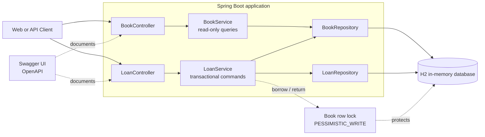
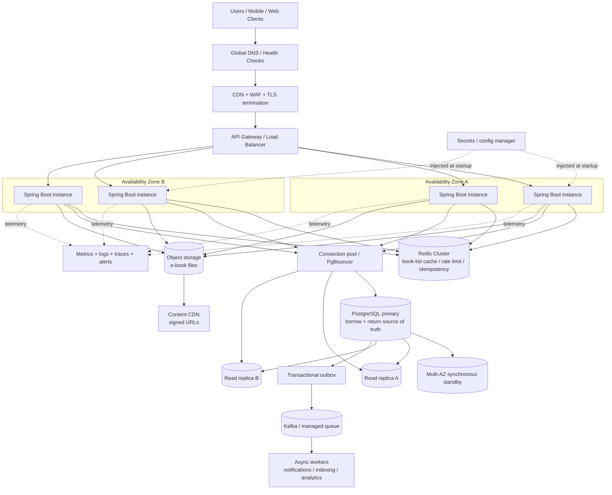

# E-Library Architecture

This document describes both the small assignment deployment and a production-oriented deployment. The two designs intentionally have different goals: the assignment favors a small, explainable codebase, while production separates read scaling, write consistency, content delivery, and operational concerns.

## 1. Take-home architecture

The `Book` row is the concurrency boundary. Borrow and return acquire a short `PESSIMISTIC_WRITE` transaction on that row, so operations for the same book are serialized while different books can be processed concurrently. H2 is deliberately single-instance and is not a production persistence choice.

## 2. Production high-performance and high-availability architecture

### Production request-routing rules

1. Browse and book-detail reads can use Redis and read replicas. Cache entries must have a bounded TTL and be invalidated or versioned after a successful inventory update.
2. Borrow and return always use the PostgreSQL primary in one transaction. The inventory decision must never be made from Redis or a replica because replica lag can oversell a license.
3. The current-loans query needs read-after-write consistency. It should use the primary immediately after a command, or use an explicit consistency token before allowing replica reads.
4. The current row-lock design can be retained on PostgreSQL. At higher contention, an atomic conditional update such as `available_licenses = available_licenses - 1 WHERE available_licenses > 0` can reduce lock hold time; the loan insert must remain in the same transaction.
5. Application instances are stateless and spread across availability zones. Horizontal Pod Autoscaling can scale them independently of the database. No in-process lock is used because it would fail across instances.
6. Redis is an optimization and coordination aid, never the source of truth for license availability. If Redis is unavailable, browsing may degrade to the database and command paths must continue to rely on PostgreSQL.
7. Notifications, search indexing, and analytics leave the borrow/return critical path through a transactional outbox and an asynchronous queue. Consumers are idempotent and can be retried.
8. E-book binaries belong in object storage and are delivered through a CDN using short-lived signed URLs. They should not be loaded through the application JVM.

### Availability and failure boundaries

- PostgreSQL uses managed failover with a synchronous standby across availability zones, read replicas for scale, backups, and point-in-time recovery.
- Redis runs as a replicated cluster with automatic failover. Its loss causes cache misses, not incorrect inventory decisions.
- The load balancer removes unhealthy application instances. Rolling deployments keep capacity available while instances are replaced.
- Database, lock-wait time, connection-pool saturation, cache hit rate, error rate, and p95/p99 latency should be observable and alertable.
- A multi-region disaster-recovery replica can be added later. Active-active writes are intentionally avoided because license allocation requires one authoritative write order per book.

### Trade-offs

The production design prioritizes correctness for the scarce resource over maximum write throughput. Reads scale horizontally through cache and replicas, while the small inventory transaction stays on one authoritative database. This is simpler and safer than introducing a distributed lock or a fully asynchronous order-book allocation path. A waitlist or FIFO allocation policy would require an explicit product requirement and a durable per-book sequence, rather than relying on request arrival order.
