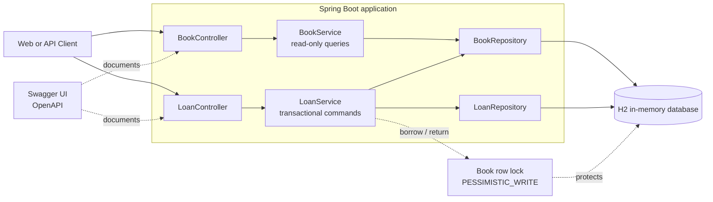
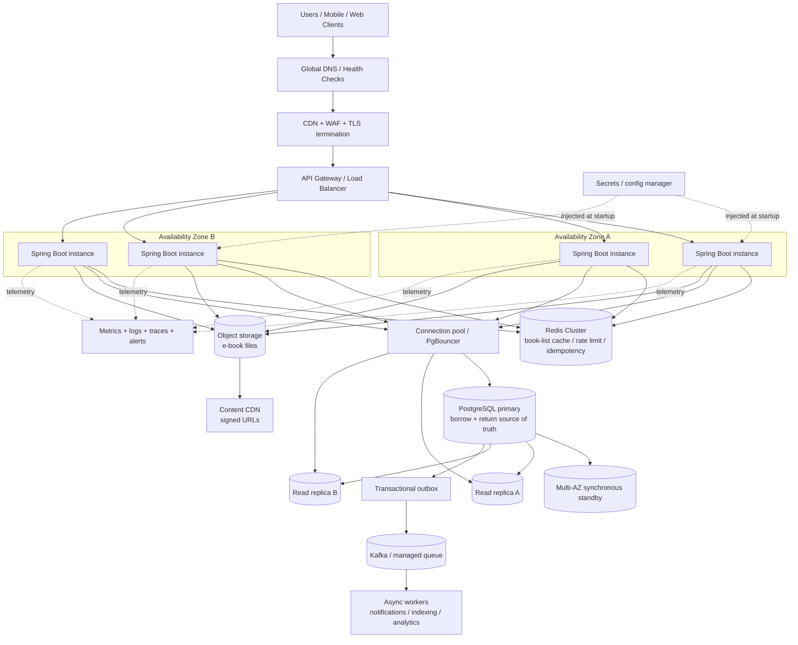

# E-Library Architecture

This document describes both the small assignment deployment and a production-oriented deployment. The two designs intentionally have different goals: the assignment favors a small, explainable codebase, while production separates read scaling, write consistency, content delivery, and operational concerns.

## 1. Take-home architecture



The `Book` row is the concurrency boundary. Borrow and return acquire a short `PESSIMISTIC_WRITE` transaction on that row, so operations for the same book are serialized while different books can be processed concurrently. H2 is deliberately single-instance and is not a production persistence choice.

## 2. Production high-performance and high-availability architecture



### Production request-routing rules

1. Browse and book-detail reads can use Redis and read replicas. Cache entries must have a bounded TTL and be invalidated or versioned after a successful inventory update.
2. Borrow and return always use the PostgreSQL primary in one transaction. The inventory decision must never be made from Redis or a replica because replica lag can oversell a license.
3. The current-loans query needs read-after-write consistency. It should use the primary immediately after a command, or use an explicit consistency token before allowing replica reads.
4. The current row-lock design can be retained on PostgreSQL. At higher contention, keep the row lock but replace the read-then-update with a single atomic conditional update: `UPDATE book SET available_licenses = available_licenses - 1 WHERE id = ? AND available_licenses > 0`, then check the affected-row count to decide whether the borrow succeeded. This shortens lock hold time while the loan insert must remain in the same transaction.
5. Application instances are stateless and spread across availability zones. Horizontal Pod Autoscaling can scale them independently of the database. No in-process lock is used because it would fail across instances.
6. Redis is an optimization and coordination aid, never the source of truth for license availability. If Redis is unavailable, browsing may degrade to the database and command paths must continue to rely on PostgreSQL.
7. Notifications, search indexing, and analytics leave the borrow/return critical path through a transactional outbox and an asynchronous queue. Consumers are idempotent and can be retried.
8. E-book binaries belong in object storage and are delivered through a CDN using short-lived signed URLs. They should not be loaded through the application JVM.

### Availability and failure boundaries

- PostgreSQL uses managed failover with a synchronous standby across availability zones, read replicas for scale, backups, and point-in-time recovery.
- Redis runs as a replicated cluster with automatic failover. Its loss causes cache misses, not incorrect inventory decisions.
- The load balancer removes unhealthy application instances. Rolling deployments keep capacity available while instances are replaced.
- Database, lock-wait time, connection-pool saturation, cache hit rate, error rate, and p95/p99 latency should be observable and alertable.
- A multi-region disaster-recovery replica can be added later. Active-active writes are intentionally avoided because license allocation requires one authoritative write order per book.

### Trade-offs

The production design prioritizes correctness for the scarce resource over maximum write throughput. Reads scale horizontally through cache and replicas, while the small inventory transaction stays on one authoritative database. This is simpler and safer than introducing a distributed lock or a fully asynchronous order-book allocation path. A waitlist or FIFO allocation policy would require an explicit product requirement and a durable per-book sequence, rather than relying on request arrival order.

## 3. Management-side (admin) API design

The take-home implementation was originally user-facing only: every loan endpoint required an `X-User-Id` header and the current-loans listing was filtered to that user. An operator could not see what is currently borrowed across all users. The requirement "view currently borrowed books" has a management-side reading ("see all active loans") in addition to the user-side reading. That management surface is now implemented.

### Identity and role model

`X-User-Id` was an opaque header and `Loan.userId` a plain string, collapsing the user/operator boundary into one seam. The implementation introduces a role without complicating the domain:

- A `PrincipalArgumentResolver` parses the identity headers into a small `Principal(userId, role)` record (see `identity/Principal.java` and `identity/Role.java`).
- `X-User-Id` carries the caller identity; `X-User-Role` carries the role claim and defaults to `USER`.
- An `AdminRoleInterceptor` registered for `/api/admin/**` enforces centralized, default-deny authorization: a request without `X-User-Role: ADMIN` is rejected with `403 FORBIDDEN`, so new admin handlers are protected without remembering to self-guard.
- The existing user-facing `LoanController` keeps its `@RequestHeader("X-User-Id") String` bound directly, so the transactional user path is unchanged.

This keeps the read-mostly admin surface disjoint from the transactional user commands, so the two concern sets do not share lock or caching behavior.

### Implemented endpoints

```text
GET /api/admin/loans/current?page=0&size=20
    X-User-Id: admin-1
    X-User-Role: ADMIN
```

`GET /api/admin/loans/current` returns all users' active loans as a `PageResponse` (same `LoanResponse` shape), paginated by `borrowedAt` descending, with `page`/`size` validated the same way as book paging. It maps to `LoanRepository.findAllByReturnedAtIsNull(Pageable)`, filtering on `returnedAt IS NULL` only, without a `userId` predicate; the batch read uses an `@EntityGraph` to fetch the associated book in one query instead of N+1. Because it is read-only on the loan table and does not mutate license counts, it is safe to serve from the primary or a consistent read replica.

### Trade-offs captured

- **Admin surface is minimal and read-only.** Only the management-side current-loans listing is implemented. Admin borrow and return are left out: an operator returning a loan on a user's behalf would force the admin path to take the same `PESSIMISTIC_WRITE` book lock and re-introduce ownership semantics. Left out unless a product need appears.
- **Role as a claim, not a table.** No user registry exists, so ADMIN is a property of the identity claim rather than a persisted entity. Supplying `X-User-Role: ADMIN` is how a caller reaches the admin endpoint. A real deployment replaces these headers with an authenticated principal (OIDC) while keeping the same `Principal` seam in the argument resolver.
- **Identity validation is centralized.** Blank, over-long, or malformed `X-User-Id` / `X-User-Role` values are rejected once in `PrincipalArgumentResolver` with a `400` `INVALID_USER` / `INVALID_ROLE` response, instead of scattered across controllers.
- **Admin reads never decide inventory.** Consistent with the production routing rules, the admin current-loan query is informational. If it ever feeds an allocation decision it must move to the primary inside a transaction.
