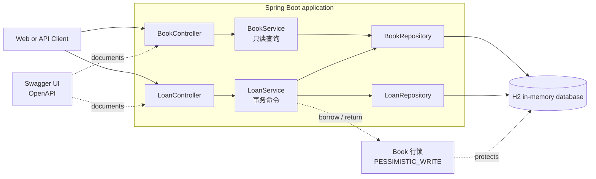
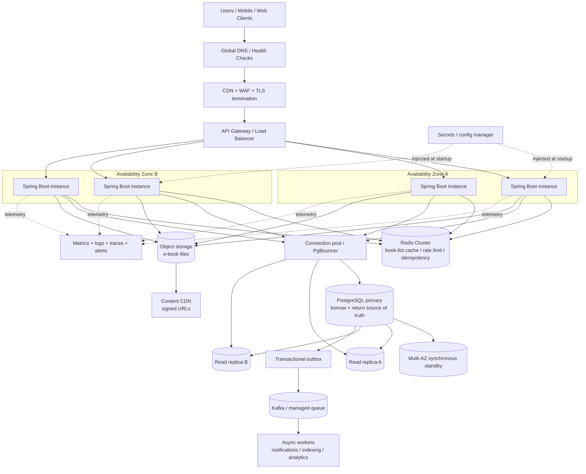

# 电子图书馆架构（E-Library Architecture）

本文件描述两套部署方案：作业的轻量部署，以及面向生产的部署。两者目标刻意不同：作业版偏向小型、可解释的代码；生产版拆分读扩展、写一致性、内容分发与运维关注点。

> 中文版。英文原版见 [architecture.md](../en/architecture.md)
> 。针对原始需求逐项的应答与设计取舍，见 [design-answers.md](design-answers.md)。

## 1. 作业架构（Take-home architecture）



`Book` 行是并发边界。借阅与归还在该行上获取一个短暂的 `PESSIMISTIC_WRITE` 事务，因此对同一本书的操作被串行化，而不同书籍可并发处理。H2
刻意采用单实例，不作为生产持久化选择。

## 2. 生产高性能高可用架构（Production high-performance and high-availability）



### 生产请求路由规则（Production request-routing rules）

1. 浏览与书籍详情读取可使用 Redis 与只读副本。缓存项必须有界 TTL，并在库存更新成功后被失效或版本化。
2. 借阅与归还始终在 PostgreSQL 主库的同一事务中执行。库存决策 **绝不可**来自 Redis 或副本，因为副本延迟可能导致超额出售授权。
3. 当前借阅查询需要读写一致性（read-after-write）。命令执行后应立即使用主库，或在允许副本读取前使用显式一致性令牌（consistency
   token）。
4. 当前行锁设计可保留在 PostgreSQL 上。在更高竞争下，保留行锁但将“读后更新”替换为 **单个原子条件更新**：
   `UPDATE book SET available_licenses = available_licenses - 1 WHERE id = ? AND available_licenses > 0`
   ，再检查受影响行数判断借阅是否成功。这缩短锁持有时间，且 loan 插入必须在同一事务内（作业实现为何选择读-改-写而非此写法，见下方“取舍”段）。
5. 应用实例无状态，跨可用区分布。可独立于数据库做水平 Pod 自动扩缩。不使用进程内锁，因为跨实例时会失效。
6. Redis 只是优化与协调手段， **绝不是授权可用性的真值来源（source of truth）**。Redis 不可用时，浏览可降级到数据库，命令路径必须继续依赖
   PostgreSQL。
7. 通知、搜索索引、分析通过事务性 outbox 与异步队列离开借阅/归还关键路径。消费方具备幂等性，可重试。
8. 电子书二进制应存放在对象存储，并通过带短时签名 URL 的 CDN 分发，不应经过应用 JVM 加载。

### 可用性与故障边界（Availability and failure boundaries）

- PostgreSQL 使用托管故障转移，跨可用区同步备用节点、只读副本用于扩展、备份与时间点恢复。
- Redis 以复制集群运行并自动故障转移。其丢失只会造成缓存未命中，不会导致错误的库存决策。
- 负载均衡移除不健康的应用实例。滚动部署在实例替换期间保持容量可用。
- 数据库、锁等待时间、连接池饱和、缓存命中率、错误率、p95/p99 延时应可观测并告警。
- 后续可加多区域灾备副本。刻意避免活跃-活跃写入，因为授权分配要求每本书有一个权威的写入顺序。

### 取舍（Trade-offs）

生产设计将稀缺资源的正确性置于写吞吐之上。读通过缓存与副本横向扩展，而很小的库存事务留在单一权威数据库。这比引入分布式锁或完全异步的订单簿式分配路径更简单、更安全。等待列表或
FIFO 分配策略需要明确的产品需求，以及每本书持久、有序的序号，而不是依赖请求到达顺序。

**作业实现为何保留“读-改-写 + 行锁”，而不是直接用第 4 条的原子 UPDATE（见规则 4）：** borrow 并非只扣一个计数器——它还要插入
loan 记录、并保证“每用户每书只借一次”。这两件事无法融进对 `book` 单行的一条 `UPDATE`，只要 loan 插入与去重检查必须与扣减原子提交在
**同一事务**，Book 行锁就从取锁一直持有到 `commit`，把“读-改-写”换成单条原子 `UPDATE` 并不会缩短锁窗口。真正要缩短临界区，是把扣减移到一张极短事务并靠
**部分唯一索引**扛去重（代价：去重从应用语义搬进
schema），那是改事务边界，不是换一条语句。因此在同等正确性下，选择读-改-写换来的是约束收在聚合内、可独立单测、读起来更直白；两种写法稳态上只差约两次
DB 往返（微秒级），竞争行为相同。

## 3. 管理面（admin）API 设计

本作业实现原本仅面向用户侧：每个借阅接口都要求 `X-User-Id`
头，当前借阅列表也限定为该用户。运营者无法看到所有用户当前借阅的书籍。“查看目前已借阅的书籍”除了用户侧语义外，天然还有管理侧语义（“查看所有活跃借阅”）。该管理面现已实现。

### 身份与角色模型（Identity and role model）

`X-User-Id` 最初是不透明的请求头，`Loan.userId` 是普通字符串，把用户/运营者边界压成了一个缝（seam）。实现引入角色而不复杂化领域模型：

- `PrincipalArgumentResolver` 把身份请求头解析成小的 `Principal(userId, role)` 记录（见 `identity/Principal.java` 与
  `identity/Role.java`）。
- `X-User-Id` 携带调用者身份；`X-User-Role` 携带角色声明，默认 `USER`。
- `AdminRoleInterceptor` 注册到 `/api/admin/**`，做**集中、默认拒绝（default-deny）**的鉴权：请求未携带 `X-User-Role: ADMIN`
  即返回 `403 FORBIDDEN`。新增管理接口无需自行守卫。
- 既有用户侧 `LoanController` 仍直接绑定 `@RequestHeader("X-User-Id") String`，事务性用户路径不变。

这样把只读为主的管理面与事务性用户命令解耦，两套关注点不共享锁或缓存行为。

### 已实现接口（Implemented endpoints）

```text
GET /api/admin/loans/current?page=0&size=20
    X-User-Id: admin-1
    X-User-Role: ADMIN
```

`GET /api/admin/loans/current` 以与 `/api/books` 一致的 `PageResponse` 返回所有用户的活跃借阅（`LoanResponse` 结构），按
`borrowedAt` 降序分页；`page`/`size` 的校验规则与书籍分页相同。它映射到
`LoanRepository.findAllByReturnedAtIsNull(Pageable)`，只按 `returnedAt IS NULL` 过滤，不含 `userId` 谓词；批量读取用
`@EntityGraph` 一次性取回书目，避免 N+1。因为只读 loan 表、不改变授权数，可安全地从主库或一致的只读副本提供。

### 已记录的取舍（Trade-offs captured）

- **管理面最小且只读。** 只实现管理侧“当前借阅列表”。不做管理端借阅与归还：运营者代用户归还会迫使管理路径取同样的
  `PESSIMISTIC_WRITE` 书锁，并重新引入所有权语义。除非出现产品需求，否则不实现。
- **角色是声明（claim），不是表。** 没有用户注册表，因此 `ADMIN` 是身份声明的属性，而非持久化实体。调用方通过提供
  `X-User-Role: ADMIN` 到达管理接口。生产环境会用经认证的主体（OIDC）替换这两个请求头，同时保留参数解析器中的 `Principal` 缝。
- **身份校验集中化。** 空白或超长 `X-User-Id` 在 `PrincipalArgumentResolver` 中返回 `400 INVALID_USER`；`/api/admin/**` 由
  `AdminRoleInterceptor` 默认拒绝，缺失或非法 `X-User-Role` 统一返回 `403 ADMIN_ROLE_REQUIRED`，而非散落在各控制器中。
- **管理读不决定库存。** 与生产路由规则一致，管理端当前借阅查询仅提供信息。若它将来要参与分配决策，则必须移入主库的事务内。
